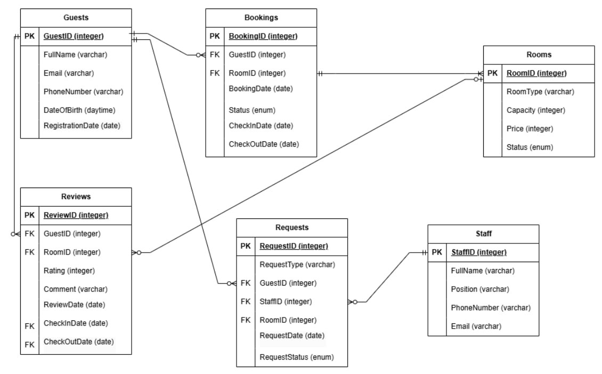

# База данных для отеля «Гранд Кисловодск»

Российские курорты набирают популярность! Не исключение и прекрасный город Кисловодск и в частности - знаменитый отель Гранд Кисловодск, сервису которого позавидуют любые европейские гостиницы Будапешта, Праги, Рима, Осло … перечислять можно бесконечно! 
Теперь с помощью таких систем управления базами данных, как PostgreSQL, отель сможет вывести свой менеджмент на новый уровень.
Далее опишем программу, которую мы предлагаем Гранд Кисловодску для более эффективного управления.


## Кому нужна разрабатываемая программа (категории пользователей)

Программа предназначена для следующих категорий пользователей:

- Администраторы — управление бронированиями и регистрацией гостей.
- Управляющие — контроль работы отеля.
- Персонал — обслуживание номеров и уборка.
- Гости — просмотр доступных номеров, бронирование, проверка заказов.
- Менеджеры — анализ данных для повышения продаж и разработки маркетинговых стратегий.

## Функциональные требования

### Регистрация и управление аккаунтами гостей

- Добавление, изменение и удаление информации о гостях.
- Хранение истории бронирований и отзывов.

### Управление бронированиями

- Создание, изменение и отмена бронирований.
- Поиск доступных номеров по параметрам.
- Подтверждение бронирований администраторами.

### Управление номерами

- Учет состояния номеров (свободен, занят, на уборке и т.д.).
- Хранение информации о типах номеров и их характеристиках.
- Управление заявками на уборку и ремонт.

### Отчётность и аналитика

- Генерация отчётов по загрузке, доходам и другим показателям.
- Анализ статистики бронирований и отзывов.

### Обратная связь

- Оставление и просмотр отзывов.
- Анализ отзывов менеджерами для улучшения качества обслуживания.

## Структура базы данных

### Сущности и атрибуты

| Сущность      | Атрибуты                                                                 |
|---------------|--------------------------------------------------------------------------|
| Гости     | GuestID (PK), FullName, Email, PhoneNumber, DateOfBirth, RegistrationDate |
| Номера    | RoomID (PK), RoomType, Capacity, Price, Status                           |
| Бронирования | BookingID (PK), GuestID (FK), RoomID (FK), CheckInDate, CheckOutDate, BookingDate, Status |
| Отзывы    | ReviewID (PK), GuestID (FK), RoomID (FK), Rating, Comment, ReviewDate   |
| Персонал  | StaffID (PK), FullName, Position, PhoneNumber, Email                    |
| Заявки    | RequestID (PK), RequestType, GuestID (FK), StaffID (FK), RoomID (FK), RequestDate, RequestStatus |

### Связи между сущностями:

- Гости могут иметь несколько бронирований, но каждое бронирование принадлежит только одному гостю (1:N).
- Номера могут быть забронированы многими гостями (через бронирования), но каждое бронирование связано только с одним номером (1:N).
- Гости могут оставить несколько отзывов, но каждый отзыв принадлежит только одному гостю (1:N).
- Номера могут получить несколько отзывов, но каждый отзыв относится только к одному номеру (1:N).
- Гости могут запросить какие-то услуги при желании, однако каждая заявка на услугу оформляется только на одного конкретного гостя (1:N).
- За сотрудником может быть закреплено несколько заявок, либо ни одного, если у него выходной день, однако каждая заявка выполняется сотрудником единолично (1:N).

### ER-диаграмма



## Примеры SQL-запросов

### Добавление информации о госте
```sql
INSERT INTO Guests (GuestID, FullName, Email, PhoneNumber, DateOfBirth, RegistrationDate)
VALUES (1, 'Брейман Александр Давидович', 'breyman@gmail.com', '+7 (777) 777-77-77', '1972-03-29', CURRENT_DATE);
